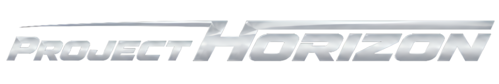

### The official desktop client for the Project Horizon FH6 touge ladder

[-fc5f2b?style=for-the-badge)](https://github.com/Quy-Anh/ProjectHorizonClient/releases/latest/download/ProjectHorizonClient-Setup.exe)
&nbsp;

[**projecthorizon.live**](https://projecthorizon.live) · [Set up your game](https://projecthorizon.live/setup) · [Leaderboards](https://projecthorizon.live/leaderboards)

---

## What it is

Project Horizon is a competitive, telemetry-verified time-attack ladder for **Forza Horizon 6** touge (mountain-pass) racing. This Windows app reads FH6's official **Data Out** telemetry on your own PC, auto-times your runs on community courses, and posts verified times to the public class leaderboards.

The mountain keeps the score.

## What it does

- **Automatic timing.** Drive to the start of any course in Free Roam. The app arms itself, starts the clock the moment you cross the line, and posts your time when you reach the finish.
- **3D replays.** Every attempt is saved as a replay you can scrub: a chase or course-map camera, plus a live input HUD (throttle, brake, clutch, steering, gear, and drift).
- **Run analysis.** Section splits and racing-line deviation against the reference line, so you can see exactly where the time went.
- **Ranks and boards.** Climb the E to S rank ladder across the C, B, A, S1, and S2 classes.
- **Live presence.** Your online, in-game, and attacking status shows across the site while you play.

## Install

1. **Download** the installer: [ProjectHorizonClient-Setup.exe](https://github.com/Quy-Anh/ProjectHorizonClient/releases/latest/download/ProjectHorizonClient-Setup.exe)
2. Run it and follow the prompts. It installs per-user (no admin needed) and adds Start menu and desktop shortcuts.
3. On first launch, sign in with your Project Horizon account, or create one right inside the app (you verify your email with a 6-digit code).

> **Windows SmartScreen warning:** the app isn't code-signed yet, so Windows may show a blue "Windows protected your PC" screen on first run. Click **More info**, then **Run anyway**. This is expected for a new indie app.

## Set up Forza Horizon 6

In FH6, open **Settings → HUD and Gameplay** and scroll to the **Data Out** section. Set these three values exactly:

| Setting | Value |
|---|---|
| Data Out | `ON` |
| IP Address | `127.0.0.1` |
| IP Port | `9909` |

Then drive to any course start gate. The full walkthrough lives at [projecthorizon.live/setup](https://projecthorizon.live/setup).

## Updating

The app checks for new versions on launch and shows a banner when one is available. Click it to download the latest installer and run it over your current install. You can also check manually in **Settings → Application**.

## Requirements

- Windows 10 or 11 (64-bit)
- Forza Horizon 6 on the **same PC**
- A free Project Horizon account

## Privacy and data

- The app reads FH6's Data Out stream **locally** and sends your run telemetry (position, speed, and inputs) to the Project Horizon server to time and verify the run.
- Your sign-in token is stored encrypted by the OS credential store (Windows DPAPI), never in plain text.
- No kernel-level or anti-cheat driver, and no access to other games or processes.
- Remove everything anytime: **Settings → Application → Uninstall** (or Windows "Add or remove programs"), which also clears the app's local data.

## Troubleshooting

Runs not showing up? Check that:

- Forza and the app are on the **same PC**.
- Data Out is **ON** with port **9909**.
- The app reads **Connected** at the top.
- You allowed the app through the **Windows Firewall** the first time it asked.

## About this repository

This is the public release home for the Project Horizon client. It hosts the installer downloads only; the application source is maintained privately.

---

Unofficial community project. Not affiliated with, endorsed by, or sponsored by Playground Games, Turn 10 Studios, or Microsoft. Forza and Forza Horizon are trademarks of Microsoft Corporation.
